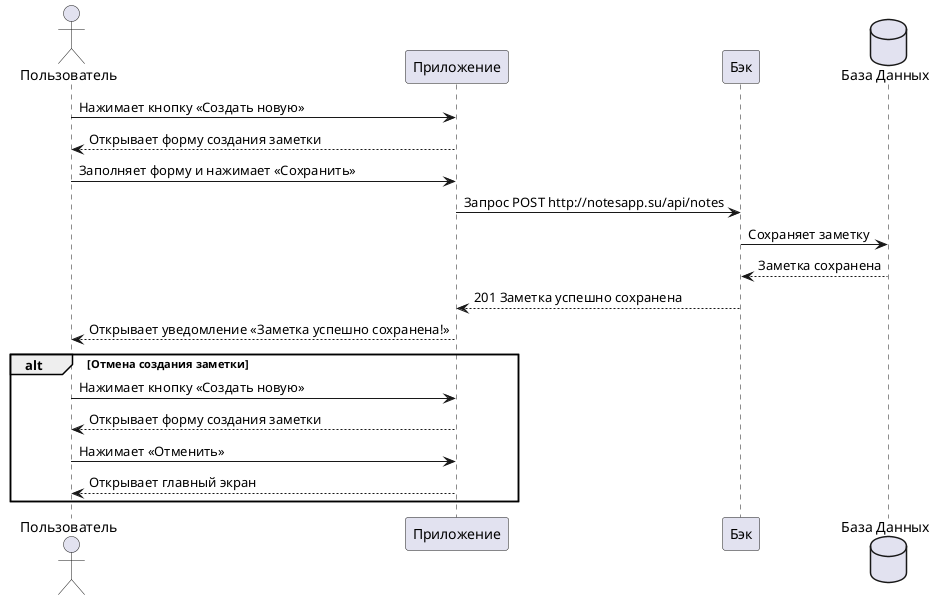

# Пользовательский сценарий «Создание новой заметки»

### Действующие лица:

1. Пользователь
2. Приложение
3. Бэк
4. База данных

### Предварительные условия

Пользователь должен находиться на главном экране.

### Выходные условия

В системе появилась новая заметка пользователя.

### Основной сценарий

1. Пользователь нажимает кнопку **Создать новую**.
2. Приложение открывает окно с формой создания новой заметки.
3. Пользователь заполняет форму заметки.
4. Пользователь нажимает кнопку **Сохранить**
5. Приложение отправляет запрос `POST http://notesapp.su/api/notes` Бэку на сохранение новой заметки.
6. Бэк сохраняет заметку в Базе данных.
7. Бэк возвращает Приложению ответ 201 «Заметка успешно создана».
8. Приложение открывает пользователю уведомление «Заметка успешно сохранена».

### Альтернативный сценарий

1. Пользователь нажимает кнопку **Создать новую**.
2. Приложение открывает окно с формой создания новой заметки.
3. Пользователь заполняет форму заметки.
4. Пользователь нажимает кнопку **Отменить**
5. Приложение открывает пользователю главный экран.

### Диаграмма последовательности

